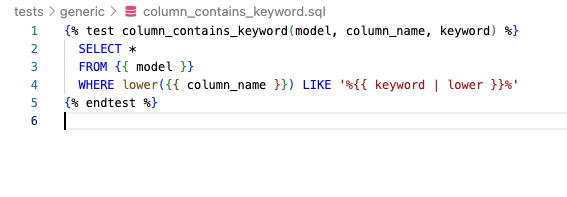
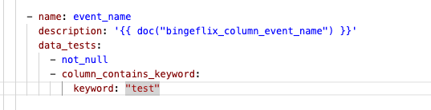
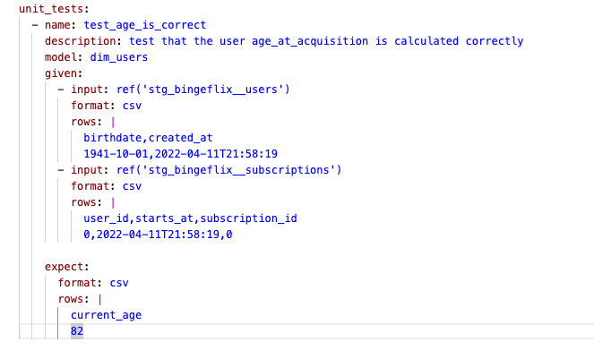

# Task 1
- I have removed all 3 tests from fct_events because the tests are already run in staging and it is a 1-1 transformation, therefore nothing will change between staging and fact. I have removed from fact in order to keep the tests as close to source as possible, making debugging easier
=> Thoughts: having a unique test on the primary key even if its redundant helps me to identify in the yml the primary key column. This is helpful when using docs blocks, as docs blocks descriptions can be generic and therefore not highlight a primary key.
=> Thoughts: in practice I would also remove pretty much all tests from either the source ymls or the staging ymls, since almost all staging tables are a 1-1 transformation I dont see the need to have both tests and feel one would suffice?

- I have updated the README.md file, adding the following rule to the models testing conventions: - Avoid retesting columns passed unchanged from staging and only test transformations: If the fact model introduces new transformations or aggregations, test those specifically.
- next step: I should also add exclusions to the project evaluator to accept fct_events not having any tests/primary key tests

# Task 2

# Task 3

=> question: for unit tests do I have to declare all the tables used in the model even if for the unit test I dont need them? eg. to test current_age I dont need the subscriptions table, but dbt seems to require me to add it as an input for the the test

# task 4
